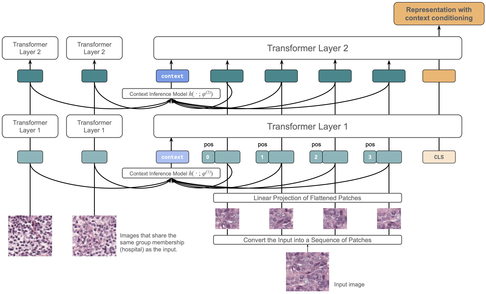

# ContextViT
ContextViT is an extension of vision transformers, designed to handle complex data distributions and covariate shifts more effectively.
+ The key feature of ContextViT is the addition of a context token t_c per context c that captures group-specific information sharing this contexgt. This token allows the model to adjust its predictions based on the group membership, taking into account the contextual effects associated with each group (we call the set of all images that are members of a group D_c).
+ There are two methods to learn the context token. The first method involves creating a context embedding dictionary that maps group membership to the context token. This dictionary is learned through gradient descent. While showing effective performance on the in-distribution data, this method, however, cannot generalize to test distributions with new groups, as these are not present in the dictionary.
+ The second method we propose is to amortize learning the context token using a context inference network. This network h() considers input images with the same group membership D_c and predicts a shared context representation token per group t_c = h(D_c). This operation can be performed before each transformer layer, enhancing the model's ability to utilize fine-grained group-specific information. Since the context inference network is conditioned on the input images, it can be applied to out-of-distribution data, using a subset of images from a group D_c.

If you have any questions or need further assistance, please don't hesitate to create an
issue. We are here to provide support and guidance. 🤗

<figure>
  <p align="center">
  
  </p>
  <figcaption width=80%><em>
  This illustration represents ContextViT in action. Prior to each Transformer layer, ContextViT applies a context inference model across all patches. These patches, extracted from images within the current batch that share identical group membership, are used to generate a context token. For the sake of simplicity, we've depicted only two Transformer layers and have represented a single patch embedding for each image on the left side.
  </em></figcaption>
</figure>
<br/>
<br/>


## Get started
### Environment
This project is developed based on [PyTorch 2.0](https://pytorch.org) and [PyTorch-Lightning
2.0.1](https://www.pytorchlightning.ai/index.html).
We use [conda](https://docs.conda.io/en/latest/) to manage the Python environment. You
can setup the enviroment by running
```bash
git clone git@github.com:insitro/ContextViT.git
cd ContextViT
conda env create -f environment.yml
conda activate contextvit
```
You can then install contextvit through pip.
```bash
pip install git+https://github.com/insitro/ContextViT.git
```

### WILDS
We recommend users to utilize the official [WILDS package](https://github.com/p-lambda/wilds) for downloading and accessing the WILDS
benchmarks.
```bash
pip install wilds

# Downloads labeled data under root_data_dir/
python wilds/download_datasets.py --root_dir root_data_dir

# Downloads unlabeled data under root_data_dir/
python wilds/download_datasets.py --root_dir root_data_dir --unlabeled
```
Once the data has been successfully downloaded, you must set the environment variable, `WILDS_DATA_PATH`, to point to the root directory of your WILDS datasets. For added convenience, you can use the scripts provided below to save this variable in your conda environment `contextvit`.
```bash
conda activate contextvit

cd $CONDA_PREFIX
mkdir -p ./etc/conda/activate.d
mkdir -p ./etc/conda/deactivate.d

echo "#\!/bin/sh" > ./etc/conda/activate.d/env_vars.sh
echo "export WILDS_DATA_PATH=root_data_dir" >> ./etc/conda/activate.d/env_vars.sh
echo "#\!/bin/sh" > ./etc/conda/deactivate.d/env_vars.sh
echo "unset WILDS_DATA_PATH" >> ./etc/conda/deactivate.d/env_vars.sh

# Need to reactivate the environment to see the changes
conda activate contextvit
```

### JUMP-CP
In this work, we utilized the cell painting benchmark, JUMP-CP, as a measure for evaluation.
We invite you to visit the original repository, [jump-cellpainting/2023\_Chandrasekaran\_submitted](https://github.com/jump-cellpainting/2023_Chandrasekaran_submitted), for further details.
To ensure the reproducibility of our results, we have made our preprocessed single-cell
images available at `s3://insitro-research-2023-context-vit`:
```
s3://insitro-research-2023-context-vit
└── jumpcp/
    ├──  platemap_and_metadata/
    ├──  BR00116991/
    │    ├── BR00116991_A01_1_12.npy
    │    ├── BR00116991_A01_1_13.npy
    │    └── ...
    ├──  BR00116993/
    ├──  BR00117000/
    ├──  BR00116991.pq
    ├──  BR00116993.pq
    └──  BR00117000.pq
```
Within each plate directory (e.g., `BR00116991/`), you will find all the single-cell images, each named in the format `PLATEID_WELLID_FIELDID_CELLID.npy`. Each single-cell image is a numpy array of dimension `8 x 224 x 224`. Accompanying each plate, we provide a pandas dataframe that catalogs all the cells within that specific plate. To facilitate easy access to this data, we have included a Python script which you can utilize.
```python
import pandas as pd

df = pd.read_parquet("s3://insitro-research-2023-context-vit/jumpcp/BR00116991.pq")
df.head(3)
```
|   | ID                  | well_loc | path                                              | plate_id   | ... |
|---|---------------------|----------|---------------------------------------------------|------------|-----|
| 0 | BR00116991_A01_1_12 | A01      | s3://insitro-research-2023-context-vit/jumpcp/BR00116991/BR00116991_A01_1_12.npy | BR00116991 | ... |
| 1 | BR00116991_A01_1_13 | A01      | s3://insitro-research-2023-context-vit/jumpcp/BR00116991/BR00116991_A01_1_13.npy | BR00116991 | ... |
| 2 | BR00116991_A01_1_15 | A01      | s3://insitro-research-2023-context-vit/jumpcp/BR00116991/BR00116991_A01_1_15.npy | BR00116991 | ... |


## ContextViT with in-distribution DINO pre-training
To pre-train ContextViT-S/16 with DINO on JUMPCP, run
```bash
python contextvit/main/main_dino.py \
    data=jumpcp_all \
    transformations=cell_dino \
    meta_arch.backbone.args.in_chans=8 \
    meta_arch.backbone.args.plate_keys=plate_id \
    meta_arch.backbone.args.plate_values=3 \
    meta_arch.backbone.args.amortization=dictionary
```
We use [hydra](https://hydra.cc) to manage our experiment configuration. By default, the above command will train the model on a single GPU. You can override the [default configuration](contextvit/config/main_dino.yaml) when running `main_dino.py`. For example, the following command will launch the DINO pre-training job using 8 gpus.
```bash
python contextvit/main/main_dino.py \
    data=jumpcp_all \
    transformations=cell_dino \
    meta_arch.backbone.args.in_chans=8 \
    meta_arch.backbone.args.plate_keys=plate_id \
    meta_arch.backbone.args.plate_values=3 \
    meta_arch.backbone.args.amortization=dictionary \
    trainer.devices=8
```
During training, we store the snapshots under `./snapshots/`. You can modify this path
by overriding the value of `trainer.default_root_dir`.

### Baselines
In the paper, we considered two ViT baselines. The first uses only a single plate
`BR00116991` for pre-training:
```bash
python contextvit/main/main_dino.py \
    data=jumpcp_BR00116991_all \
    transformations=cell_dino \
    meta_arch.backbone.args.in_chans=8 \
    meta_arch.backbone.args.plate_keys=[] \
```
The second baseline combines the three plates for joint DINO pre-training:
```bash
python contextvit/main/main_dino.py \
    data=jumpcp_all \
    transformations=cell_dino \
    meta_arch.backbone.args.in_chans=8 \
    meta_arch.backbone.args.plate_keys=[] \
```
We note that the official ViT implementation is written in Jax
[google-research/vision_transformer].
In this work, we derive our code from Facebook's PyTorch ViT implementation
.
Users should also cite the original source if they find our work useful.

It's important to note that the official ViT implementation is provided by Google
Research's Vision Transformer ([google-research/vision\_transformer](https://github.com/google-research/vision_transformer)), which is written in
Jax. In this project, we base our code on Facebook's PyTorch ViT implementation
([facebookresearch/dino](https://github.com/facebookresearch/dino/blob/main/vision_transformer.py)).
If users find our work beneficial, we kindly request that they also acknowledge the
original source in their citations.

### Evaluation on three plates
After the training process is complete, we can proceed to the evaluation phase. This
involves classifying gene perturbation types based on the embeddings we've learned. In
the case of JUMP-CP, our findings indicate that employing a one-layer MLP yields
significantly superior results compared to a linear classifier. Therefore we adopted
this MLP probing in our comparison:
```bash
for PLATE in BR00116991 BR00116993 BR00117000
do
    python contextvit/main/main_linear_prob.py \
        data@train_data=jumpcp_${PLATE}_train \
        data@val_data_dict=[jumpcp_${PLATE}_test] \
        transformations=cell \
        meta_arch.target=label \
        meta_arch.num_classes=161 \
        meta_arch.use_mlp=True \
        meta_arch.checkpoint=${PATH_TO_CKPT}
done
```

## ContextViT with out-of-distribution DINO pre-training

In a similar vein, by modifying the Hydra configurations, we can train a ContexViT-S/8 model for the Camelyon17-WILDS benchmark. It's important to note that in our implementation, we exclusively used unlabeled images from the training hospitals. We ensured that no images from the testing hospitals were utilized during the pre-training phase.
```bash
python contextvit/main/main_dino.py \
    data=camelyon_unlabeled \
    transformations=camelyon_dino \
    meta_arch.backbone.args.in_chans=3 \
    meta_arch.backbone.args.plate_keys=[hospital_id] \
    meta_arch.backbone.args.plate_values=5 \
    meta_arch.backbone.args.amortization=linear_mean \
    trainer.devices=8
```

### Baseline
For the sake of comparison, we also pre-trained a ViT-S/8 baseline using DINO on the identical dataset:
```bash
python contextvit/main/main_dino.py \
    data=camelyon_unlabeled \
    transformations=camelyon_dino \
    meta_arch.backbone.args.in_chans=3 \
    meta_arch.backbone.args.plate_keys=[] \
    trainer.devices=8
```

### Evaluation on unseen hospitals
Upon completion of the pre-training process, we employ the standard linear probing technique. During this training phase, the linear classifier is learned based on the frozen ViT embeddings. When it comes to testing, we assess its accuracy on held-out images sourced from both the in-distribution hospitals and the out-of-distribution hospitals.
```bash
python contextvit/main/main_linear_prob.py \
        data@train_data=camelyon_train \
        data@val_data_dict=[camelyon_id_val,camelyon_val,camelyon_test] \
        meta_arch.target=tumor \
        meta_arch.num_classes=2 \
        meta_arch.use_mlp=False \
        meta_arch.checkpoint=${PATH_TO_CKPT}
```

## Citation

This project was presented at the SCIS Workshop at ICML 2023 ([link](https://icml.cc/virtual/2023/26329)).
If our work contributes to your research, we would greatly appreciate a citation.
Additionally, if you utilize our processed JUMPCP dataset, please ensure to cite both our work and the original JUMP-CP paper ([link](https://www.biorxiv.org/content/10.1101/2022.01.05.475090v1)). Thank you for your support!
```
@article{bao2023contextual,
  title={Contextual Vision Transformers for Robust Representation Learning},
  author={Bao, Yujia and Karaletsos, Theofanis},
  journal={arXiv preprint arXiv:2305.19402},
  year={2023}
}
```
